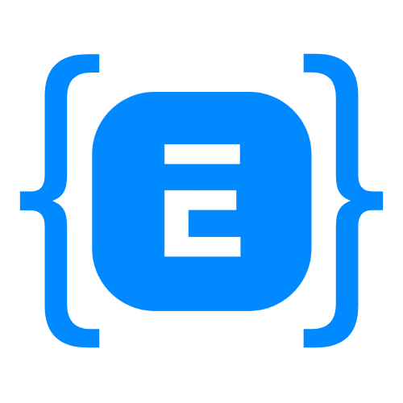

<div align="center" markdown="1">

<a href="https://github.com/washmoredevelopment/erpnext-dev-container">
  <picture>
    <source media="(prefers-color-scheme: dark)" srcset="./.github/assets/erpdev_dark.png">
    
  </picture>
</a>

# erpnext dev container

**One click containerized environment for ERPNext Development**

  [![MIT License][license-shield]][license-url]

<p align="center">
  <br />
  <a href="https://github.com/washmoredevelopment/erpnext-dev-container/issues/new?labels=bug">Report Bug</a>
  ·
  <a href="https://github.com/washmoredevelopment/erpnext-dev-container/issues/new?labels=enhancement">Request Feature</a>
</p>

</div>

<a id="readme-top"></a>

<!-- TABLE OF CONTENTS -->
<details>
  <summary>Table of Contents</summary>
  <ol>
    <li>
      <a href="#about-the-project">About The Project</a>
      <ul>
        <li><a href="#built-with">Built With</a></li>
      </ul>
    </li>
    <li>
      <a href="#getting-started">Getting Started</a>
      <ul>
        <li><a href="#prerequisites">Prerequisites</a></li>
        <li><a href="#installation">Installation</a></li>
      </ul>
    </li>
    <li><a href="#usage">Usage</a></li>
    <li><a href="#features">Features</a></li>
    <li><a href="#contributing">Contributing</a></li>
    <li><a href="#license">License</a></li>
    <li><a href="#contact">Contact</a></li>
  </ol>
</details>

<!-- ABOUT THE PROJECT -->
## About The Project

ERPNext Dev Container is a single-container Docker setup for Frappe/ERPNext v15 development. It initializes a complete bench on first run, installs configured apps, creates a site, and provides a fast, repeatable workflow for local development on macOS, Linux, and Windows with Docker Desktop.

- Single-container setup on Ubuntu 24.04 LTS
- Flexible app configuration via `APPS` in `docker-compose.yml`
- Optional private repo access via `SSH_KEY_PATH`
- All dependencies included (MariaDB, Redis, Python, Node)
- Developer mode and `bench watch` enabled
- Persistent volumes: `frappe-data` and `frappe-mysql`
- Health checks with clear status and logs
- ARM64 and AMD64 supported
- Run multiple containers for isolated environments

### Built With

<div align="left">

[![Docker][Docker]][Docker-url]
[![Ubuntu][Ubuntu]][Ubuntu-url]
[![Frappe][Frappe.io]][Frappe-url]
[![ERPNext][ERPNext.com]][ERPNext-url]
[![Python][Python.py]][Python-url]
[![Node.js][Node.js]][Node-url]
[![MariaDB][MariaDB]][MariaDB-url]
[![Redis][Redis]][Redis-url]

</div>

<!-- GETTING STARTED -->
## Getting Started

### Prerequisites

* Docker Desktop with Compose v2
* At least 4 GB RAM available to Docker
* 10+ GB free disk space

### Installation

#### Option 1: Using Pre-built Image

1. Download the configuration files
   ```bash
   curl -o docker-compose.yml https://raw.githubusercontent.com/washmoredevelopment/erpnext-dev-container/main/docker-compose.yml
   curl -o env.example https://raw.githubusercontent.com/washmoredevelopment/erpnext-dev-container/main/env.example
   ```

2. Copy the example environment file
   ```bash
   cp env.example .env
   ```

3. (Optional) Edit `.env`:
   - `IMAGE_TAG` (default: `latest`) - specify version like `v1.0.0`
   - `SITE_NAME` (default: `development.localhost`)
   - `DB_ROOT_PASSWORD`
   - `ADMIN_PASSWORD`
   - `SSH_KEY_PATH` (for private repos)

4. Start the container
   ```bash
   docker compose up -d
   ```

#### Option 2: Build from Source

1. Clone the repository
   ```bash
   git clone https://github.com/washmoredevelopment/erpnext-dev-container.git
   cd erpnext-dev-container
   ```

2. Copy and configure environment
   ```bash
   cp env.example .env
   # Edit .env as needed
   ```

3. Build and start
   ```bash
   docker compose -f docker-compose.build.yml build
   docker compose -f docker-compose.build.yml up -d
   ```

#### Completing Setup

5. First run takes ~10–15 minutes to initialize

6. After installation completes, restart
   ```bash
   docker compose down
   docker compose up -d
   ```

7. Access ERPNext: http://localhost:8000
   - Username: `Administrator`
   - Password: value of `ADMIN_PASSWORD` (default `admin`)

<p align="right">(<a href="#readme-top">back to top</a>)</p>

<!-- USAGE EXAMPLES -->
## Usage

#### Container management
```bash
docker compose up -d      # start
docker compose down       # stop
docker compose logs -f    # logs
```

#### Shell and bench
```bash
docker compose exec frappe zsh
docker compose exec frappe zsh -lc "cd /home/frappeuser/frappe-bench && bench <command>"
```

#### Container health
```bash
# Check container health
docker ps  # Shows health: starting/healthy/unhealthy

# View detailed health status
docker exec -it frappe-dev cat /tmp/container_health

# Manual health check
docker exec -it frappe-dev /usr/local/bin/health-check
```

#### Running Multiple Containers
```
services:
  # First ERPNext instance
  frappe-dev1:
    image: ghcr.io/washmoredevelopment/erpnext-dev-container:${IMAGE_TAG:-latest}
    container_name: frappe-dev1
    env_file:
      - .env.dev1
    ports:
      - "8001:8000"    # Frappe web server
      - "9001:9000"    # Frappe socketio
    extra_hosts:
      - "host.docker.internal:host-gateway"
    volumes:
      - frappe-data-dev1:/home/frappeuser
      - frappe-mysql-dev1:/var/lib/mysql
      - ${SSH_KEY_PATH}:/tmp/ssh_key:ro
    tty: true
    stdin_open: true
    restart: "no"
    environment:
      APPS: |
        erpnext:version-15
        hrms:version-15

  # Second ERPNext instance  
  frappe-dev2:
    image: ghcr.io/washmoredevelopment/erpnext-dev-container:${IMAGE_TAG:-latest}
    container_name: frappe-dev2
    env_file:
      - .env.dev2
    ports:
      - "8002:8000"    # Frappe web server
      - "9002:9000"    # Frappe socketio
    extra_hosts:
      - "host.docker.internal:host-gateway"
    volumes:
      - frappe-data-dev2:/home/frappeuser
      - frappe-mysql-dev2:/var/lib/mysql
      - ${SSH_KEY_PATH}:/tmp/ssh_key:ro
    tty: true
    stdin_open: true
    restart: "no"
    environment:
      APPS: |
        erpnext:version-15
        hrms:version-15
        # You can have different apps per instance

volumes:
  frappe-data-dev1:
  frappe-mysql-dev1:
  frappe-data-dev2:
  frappe-mysql-dev2:
```

<p align="right">(<a href="#readme-top">back to top</a>)</p>

<!-- CONTRIBUTING -->
## Contributing

Contributions are welcome. If you have ideas or find issues, please open an issue or submit a pull request.

1. Fork the project
2. Create your feature branch (`git checkout -b feature/amazing-feature`)
3. Commit your changes (`git commit -m 'feat: add amazing feature'`)
4. Push to the branch (`git push origin feature/amazing-feature`)
5. Open a Pull Request

<p align="right">(<a href="#readme-top">back to top</a>)</p>

<!-- LICENSE -->
## License

Distributed under the MIT License. See `LICENSE` for more information.

<p align="right">(<a href="#readme-top">back to top</a>)</p>

<!-- CONTACT -->
## Contact

Questions or feedback? Please open an issue on GitHub.

Repo: [https://github.com/washmoredevelopment/erpnext-dev-container](https://github.com/washmoredevelopment/erpnext-dev-container)

<p align="right">(<a href="#readme-top">back to top</a>)</p>

<!-- MARKDOWN LINKS & IMAGES -->
<!-- https://www.markdownguide.org/basic-syntax/#reference-style-links -->
[contributors-shield]: https://img.shields.io/github/contributors/washmoredevelopment/erpnext-dev-container.svg?style=flat
[contributors-url]: https://github.com/washmoredevelopment/erpnext-dev-container/graphs/contributors
[forks-shield]: https://img.shields.io/github/forks/washmoredevelopment/erpnext-dev-container.svg?style=flat
[forks-url]: https://github.com/washmoredevelopment/erpnext-dev-container/network/members
[stars-shield]: https://img.shields.io/github/stars/washmoredevelopment/erpnext-dev-container.svg?style=flat
[stars-url]: https://github.com/washmoredevelopment/erpnext-dev-container/stargazers
[issues-shield]: https://img.shields.io/github/issues/washmoredevelopment/erpnext-dev-container.svg?style=flat
[issues-url]: https://github.com/washmoredevelopment/erpnext-dev-container/issues
[license-shield]: https://img.shields.io/badge/License-MIT-green?style=flat
[license-url]: https://github.com/washmoredevelopment/erpnext-dev-container/blob/main/LICENSE

[Docker]: https://img.shields.io/badge/Docker-2496ED?style=flat&logo=docker&logoColor=white
[Docker-url]: https://www.docker.com/
[Ubuntu]: https://img.shields.io/badge/Ubuntu-E95420?style=flat&logo=ubuntu&logoColor=white
[Ubuntu-url]: https://ubuntu.com/
[Python.py]: https://img.shields.io/badge/Python-3776AB?style=flat&logo=python&logoColor=white
[Python-url]: https://python.org/
[Frappe.io]: https://img.shields.io/badge/Frappe-0089FF?style=flat&logo=frappe&logoColor=white
[Frappe-url]: https://frappeframework.com/
[ERPNext.com]: https://img.shields.io/badge/ERPNext-0089FF?style=flat&logo=erpnext&logoColor=white
[ERPNext-url]: https://erpnext.com/
[Node.js]: https://img.shields.io/badge/Node.js-339933?style=flat&logo=nodedotjs&logoColor=white
[Node-url]: https://nodejs.org/
[MariaDB]: https://img.shields.io/badge/MariaDB-003545?style=flat&logo=mariadb&logoColor=white
[MariaDB-url]: https://mariadb.org/
[Redis]: https://img.shields.io/badge/Redis-DC382D?style=flat&logo=redis&logoColor=white
[Redis-url]: https://redis.io/
